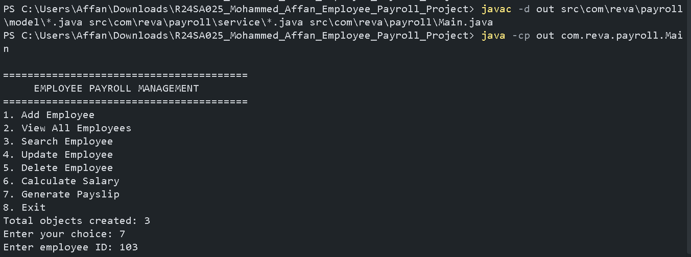
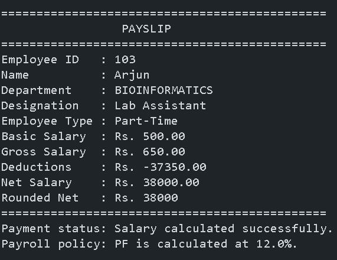
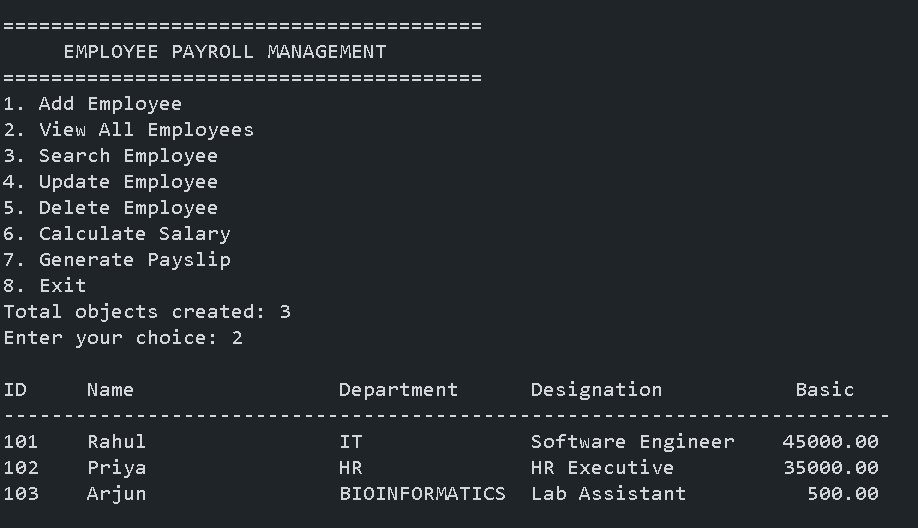

# Employee Payroll Management System

## 1. Project Overview

The **Employee Payroll Management System** is a Java-based console application developed as a Java OOP Mini Project. The system is designed to manage employee information and perform payroll-related operations in a simple and organized manner.

The application supports different types of employees and provides operations such as adding, viewing, searching, updating and deleting employee records. It also performs salary calculations and generates employee payslips.

The project demonstrates the practical implementation of important **Object-Oriented Programming concepts in Java**, including inheritance, abstraction, encapsulation, polymorphism and interfaces.

### Student Information

| Details | Information |
|---|---|
| Student Name | Mohammed Affan |
| USN | R24SA025 |
| University | REVA University |
| Course/Project | Java OOP Mini Project |
| Programming Language | Java |
| Application Type | Console-Based Application |

---

## 2. How to Compile and Run

### Software Requirements

The following software is required to run the project:

- Java JDK
- Visual Studio Code or any Java-supported IDE
- Command Prompt / PowerShell / Terminal

### Project Structure

```text
R24SA025_Mohammed_Affan_Employee_Payroll_Project
│
├── src
│   └── com
│       └── reva
│           └── payroll
│               ├── Main.java
│               │
│               ├── model
│               │   ├── Employee.java
│               │   ├── PermanentEmployee.java
│               │   ├── ContractEmployee.java
│               │   ├── PartTimeEmployee.java
│               │   ├── Department.java
│               │   └── Payable.java
│               │
│               └── service
│                   ├── EmployeeManager.java
│                   └── PayrollService.java
│
├── README.md
├── .gitignore
├── Sample_Output
└── Traceability_Report
```

### Step 1: Open the Project

Open the project folder in Visual Studio Code.

### Step 2: Open Terminal

In Visual Studio Code, select:

```text
Terminal → New Terminal
```

Make sure the terminal is opened inside the project folder.

### Step 3: Compile the Project

Run the following command:

```text
javac -d out src\com\reva\payroll\model\*.java src\com\reva\payroll\service\*.java src\com\reva\payroll\Main.java
```

If there are no compilation errors, the Java source files will be compiled successfully.

### Step 4: Run the Application

Run:

```text
java -cp out com.reva.payroll.Main
```

The Employee Payroll Management System menu will then appear in the terminal.

### Main Class

```text
com.reva.payroll.Main
```

---

## 3. Main Features

The Employee Payroll Management System provides the following features:

### Employee Management

- Add new employee
- View employee details
- Search employee by ID
- Update employee details
- Delete employee records
- Manage multiple employee types

### Payroll Management

- Calculate employee salary
- Process payroll information
- Generate employee payslip
- Display salary-related information

### Employee Types

The system supports:

- Permanent Employee
- Contract Employee
- Part-Time Employee

### Department Management

The system includes a `Department` class for organizing department-related employee information.

### Console Menu

The application provides a menu-driven console interface that allows users to select different operations.

---

## 4. Mandatory Feature Traceability

The following table shows how the major project requirements are implemented in the source code.

| Mandatory Feature | Implementation |
|---|---|
| Employee Management | `EmployeeManager.java` |
| Employee Model | `Employee.java` |
| Permanent Employee | `PermanentEmployee.java` |
| Contract Employee | `ContractEmployee.java` |
| Part-Time Employee | `PartTimeEmployee.java` |
| Department Management | `Department.java` |
| Payment Interface | `Payable.java` |
| Payroll Processing | `PayrollService.java` |
| User Interaction | `Main.java` |
| Add Employee | `EmployeeManager.java` |
| View Employee | `EmployeeManager.java` |
| Search Employee | `EmployeeManager.java` |
| Update Employee | `EmployeeManager.java` |
| Delete Employee | `EmployeeManager.java` |
| Salary Calculation | `PayrollService.java` |
| Payslip Generation | `PayrollService.java` |
| Menu-Driven Interface | `Main.java` |

### Feature Flow

```text
User
  │
  ▼
Main.java
  │
  ▼
EmployeeManager.java
  │
  ├── Add Employee
  ├── View Employee
  ├── Search Employee
  ├── Update Employee
  └── Delete Employee
  │
  ▼
PayrollService.java
  │
  ├── Salary Calculation
  └── Payslip Generation
  │
  ▼
Employee Output
```

---

## 5. Important OOP Design Notes

The project demonstrates several important Object-Oriented Programming concepts.

### 5.1 Encapsulation

Employee-related data and operations are organized inside classes.

The employee classes contain employee attributes and methods that operate on those attributes. This provides a structured way to manage employee information.

### 5.2 Inheritance

The project uses inheritance to create specialized employee classes from the common `Employee` class.

The employee hierarchy is:

```text
Employee
│
├── PermanentEmployee
│
├── ContractEmployee
│
└── PartTimeEmployee
```

Common employee properties and behavior are maintained in the parent `Employee` class, while specialized employee classes provide their respective functionality.

### 5.3 Abstraction

The project uses an abstract `Employee` class to represent common employee-related structure and behavior.

Abstraction helps separate the general employee concept from specific employee implementations.

### 5.4 Interface

The `Payable` interface defines payment-related behavior.

This allows payroll-related functionality to follow a common contract.

### 5.5 Polymorphism

Polymorphism allows different employee types to be handled using common employee references while providing type-specific behavior.

For example, permanent, contract and part-time employees can be managed through the common employee structure.

### 5.6 Packages

The project is divided into packages for better organization.

```text
com.reva.payroll
com.reva.payroll.model
com.reva.payroll.service
```

The `model` package contains employee-related classes, while the `service` package contains employee management and payroll processing functionality.

### 5.7 Separation of Responsibilities

The project separates responsibilities between different classes:

- `Main.java` — User interaction and menu
- `Employee.java` — Common employee structure
- `PermanentEmployee.java` — Permanent employee implementation
- `ContractEmployee.java` — Contract employee implementation
- `PartTimeEmployee.java` — Part-time employee implementation
- `Department.java` — Department information
- `Payable.java` — Payment-related interface
- `EmployeeManager.java` — Employee record management
- `PayrollService.java` — Payroll and salary processing

---

## 6. Testing

The application was tested for different employee-management and payroll operations.

### 6.1 Employee Management Testing

The following operations were tested:

- Adding an employee
- Displaying employee details
- Searching for an employee
- Updating employee information
- Deleting an employee

### 6.2 Employee Type Testing

Different employee categories were tested:

- Permanent Employee
- Contract Employee
- Part-Time Employee

### 6.3 Payroll Testing

The following payroll operations were tested:

- Salary calculation
- Payroll processing
- Payslip generation
- Displaying salary information

### 6.4 Menu Testing

The menu-driven interface was tested by selecting different menu options and verifying the corresponding operations.

### 6.5 Compilation Testing

The project was compiled using:

```text
javac -d out src\com\reva\payroll\model\*.java src\com\reva\payroll\service\*.java src\com\reva\payroll\Main.java
```

### 6.6 Execution Testing

The application was executed using:

```text
java -cp out com.reva.payroll.Main
```

### 6.7 Expected Result

The application should start successfully and display the employee payroll management menu in the terminal.

---

## 7. Submission Contents

The project submission contains the following files and documentation.

### Source Code

```text
Main.java
Employee.java
PermanentEmployee.java
ContractEmployee.java
PartTimeEmployee.java
Department.java
Payable.java
EmployeeManager.java
PayrollService.java
```

### Documentation

```text
README.md
Sample_Output
Traceability_Report
```

### Project Organization

```text
R24SA025_Mohammed_Affan_Employee_Payroll_Project
│
├── src
│   └── com
│       └── reva
│           └── payroll
│               ├── Main.java
│               │
│               ├── model
│               │   ├── Employee.java
│               │   ├── PermanentEmployee.java
│               │   ├── ContractEmployee.java
│               │   ├── PartTimeEmployee.java
│               │   ├── Department.java
│               │   └── Payable.java
│               │
│               └── service
│                   ├── EmployeeManager.java
│                   └── PayrollService.java
│
├── README.md
├── .gitignore
├── Sample_Output
└── Traceability_Report
```

### GitHub Repository

The project is maintained in a GitHub repository for version control and submission.

---

## Conclusion

The Employee Payroll Management System demonstrates the practical application of Java Object-Oriented Programming concepts in developing a console-based payroll application.

The project integrates employee management, different employee types, salary calculation, payroll processing and payslip generation into a single application.

The project also demonstrates the use of inheritance, abstraction, encapsulation, polymorphism, interfaces and package organization in Java.

---

## 8. Sample Program Output

### 1. Main Menu



### 2. Employee List



### 3. Generated Payslip
 

---
## Student

**Name:** Mohammed Affan  
**USN:** R24SA025  
**Programme:** B.Sc. Bioinformatics, Computer Science and Statistics (BSTCS)  
**Semester:** 5th Semester  
**University:** REVA University
